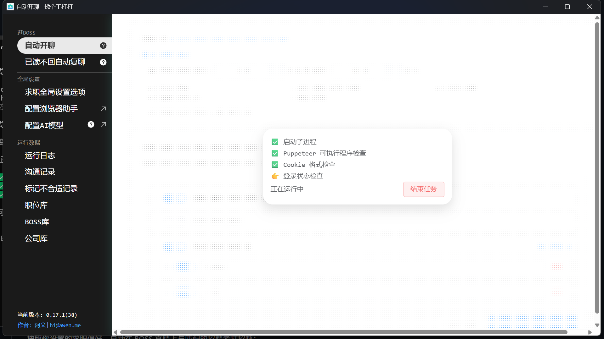
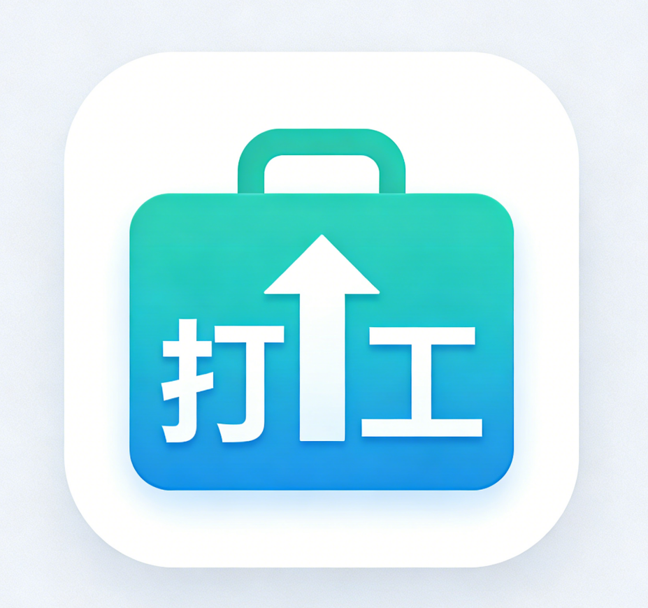

# 🔥 打个工 - 打工人求职神器

> **BOSS 炸弹** - 自动开聊 BOSS，助力每位打工人求职！

---

## 📌 项目声明

**本项目基于 [dagegong/dagegong](https://github.com/dagegong/dagegong) 进行二次开发。**

原项目是一个开源的 BOSS 直聘自动化工具，感谢原作者的贡献。本项目在此基础上进行了部分定制和优化。对主题 功能做了增删。

- 🔗 原项目地址：https://github.com/geekgeekrun/geekgeekrun 
- 📝 原项目作者：[@geekgeekrun](https://github.com/geekgeekrun)

---

<p align="center">
  
</p>

<p align="center">
  
</p>

<p align="center">
  <a href="https://github.com/monkey-wenjun/dagegong/actions"></a>
  <a href="https://github.com/monkey-wenjun/dagegong/releases"></a>
  <a href="LICENSE"></a>
</p>

## ✨ 功能特性


### 🎯 AI 自动找工作
按照你设置的求职偏好，自动在 BOSS 直聘上与匹配的招聘者打招呼：

- **智能匹配** - 根据公司名称、职位类型、职位描述自动筛选目标职位
- **自定义打招呼** - 支持三种模式：BOSS 默认、固定自定义消息、AI 智能生成
- **活跃度检测** - 自动跳过长期不活跃的 BOSS，提高回复率
- **自动筛选** - 不匹配的职位自动标记为不合适，减少无效推荐
- **每日限额控制** - 自动检测沟通次数，用完后智能暂停，次日自动恢复
- **无头模式**  - 登录后自动保存 cookies 并在无头模式下进行工作
- **运行日志** - 可以在无头模式下检查是否正常工作

### 🤖 AI 自动回复（内置）
与 AI 自动找工作集成在同一页面，自动检测 HR 发来的新消息并智能回复：

- **智能检测** - 每 30 秒检查一次沟通记录，识别需要回复的新消息
- **AI 生成回复** - 集成 Dify AI，根据聊天上下文生成专业回复
- **自动发送** - 无需人工干预，自动发送 AI 生成的回复
- **灵活配置** - 支持自定义 API 地址和 Key
- **一键测试** - 支持测试 API 连接和回复效果

### 📄 自动发送简历
当 BOSS 在聊天中索要简历时，自动检测并发送简历：

- **智能识别** - 检测 BOSS 消息中的简历索要关键词（"发份简历"、"附件简历"等）
- **完整上下文分析** - 分析最近 20 条聊天记录，准确判断是否需要发送
- **防重复发送** - 自动识别已发送过简历的对话，避免重复发送
- **支持标签筛选** - 可按标签筛选需要自动发送简历的聊天对象


### 💬 已读不回自动复聊
BOSS 已读不回？自动提醒功能帮你把握机会：

- **智能检测** - 自动查找已读不回的聊天
- **定时跟进** - 支持设置跟进时限和间隔
- **AI 回复** - 集成大语言模型，根据简历和聊天上下文生成个性化跟进内容
- **多种提醒** - 支持发送表情和自定义消息

### 📊 数据管理
- **职位库** - 管理所有浏览过的职位信息
- **公司库** - 记录和筛选目标公司
- **BOSS 库** - 管理沟通过的招聘者
- **聊天记录同步** - 支持从 BOSS 直聘同步聊天记录到本地（支持 API 和 DOM 双模式获取）
- **运行日志** - 查看详细的操作记录和 API 调试信息

### ⚙️ 高级配置
- **任务管理** - 创建和管理多个求职任务
- **LLM 配置** - 配置 AI 回复服务（Dify）
- **Cookie 助手** - 便捷登录 BOSS 直聘，支持自动保存登录状态
- **浏览器检测** - 智能检测系统已安装的 Chrome/Edge 浏览器，无需手动配置
- **可执行程序检查** - 自动检查浏览器可执行程序是否正常
- **主题切换** - 支持亮色/暗色/自动三种主题模式
- **详细日志** - 完整的 API 请求/响应日志，便于排查问题

### 🖥️ CLI 命令行工具
适合服务器部署的命令行版本：

- **无头模式运行** - 不需要 GUI，适合服务器挂机
- **AI 守护进程** - 独立于投递流程的 AI 回复服务，投递崩溃后自动恢复
- **每日统计报告** - 每天 21:00 自动发送飞书汇总
- **Systemd 集成** - 支持 systemd 服务管理，实现开机自启
- **一键启停** - 简单的命令行控制，支持启动、停止、状态查询

## 🚀 快速开始

### 下载安装

访问 [Releases](https://github.com/monkey-wenjun/dagegong/releases) 页面下载最新版本：

- **Windows**: `dagegong-ui_x.x.x_x64_setup.exe`
- **macOS**: `dagegong-ui_x.x.x.dmg`
- **Linux**: `dagegong-ui_x.x.x.AppImage`

---

## 💻 CLI 命令行工具

除了桌面端应用外，本项目还提供了 CLI 工具，支持在服务器无头模式运行，适合长期挂机自动投递。

### 安装 CLI

```bash
# 进入 CLI 目录
cd packages/dagegong-cli

# 安装依赖
pnpm install

# 初始化配置
node bin/cli.mjs init
```

### CLI 主要命令

```bash
# 查看帮助
node bin/cli.mjs --help

# 运行投递任务（默认使用配置文件中的每日限额）
node bin/cli.mjs run --headless

# 运行投递（指定数量）
node bin/cli.mjs run --limit 10 --headless

# 查看今日统计
node bin/cli.mjs today

# 测试飞书通知
node bin/cli.mjs test-notify
```

### AI 自动回复守护进程

CLI 版本支持独立的 AI 守护进程，投递浏览器崩溃后 AI 服务仍然继续运行：

```bash
# 启动 AI 守护进程
node bin/cli.mjs ai-daemon --start

# 查看状态
node bin/cli.mjs ai-daemon --status

# 停止 AI 守护进程
node bin/cli.mjs ai-daemon --stop
```

### 自动发送简历配置

```bash
# 查看状态
node bin/cli.mjs resume

# 启用自动发简历
node bin/cli.mjs resume --enable

# 启用并指定标签筛选
node bin/cli.mjs resume --enable --label 1 --label-name "已投递"

# 禁用
node bin/cli.mjs resume --disable
```

### AI 自动回复配置

```bash
# 配置 Dify API
node bin/cli.mjs ai-reply --enable
node bin/cli.mjs ai-reply --url http://192.168.1.29/v1/chat-messages --key your-api-key

# 测试 AI API
node bin/cli.mjs test-ai
```

---

## 🖥️ 服务器部署（Systemd）

推荐使用 systemd 管理服务，实现开机自启和自动重启：

### 1. 创建服务文件

创建 `/etc/systemd/system/dagegong-ai-daemon.service`：

```ini
[Unit]
Description=Dagegong AI Auto-Reply Daemon
After=network-online.target

[Service]
Type=simple
User=wenjun
Group=wenjun
WorkingDirectory=/home/wenjun/dagegong-app/packages/dagegong-cli
Environment="NVM_DIR=/home/wenjun/.nvm"
Environment="NODE_VERSION=22"
Environment="PUPPETEER_EXECUTABLE_PATH=/usr/bin/google-chrome"
ExecStart=/usr/bin/env bash -c "source /home/wenjun/.nvm/nvm.sh && nvm use 22 && exec node src/ai-auto-reply-daemon.mjs --daemon"
Restart=always
RestartSec=10
StandardOutput=append:/home/wenjun/.dagegong-cli/logs/ai-daemon-systemd.log
StandardError=append:/home/wenjun/.dagegong-cli/logs/ai-daemon-systemd.log

[Install]
WantedBy=multi-user.target
```

创建 `/etc/systemd/system/dagegong-apply.timer`：

```ini
[Unit]
Description=Dagegong Job Apply Timer

[Timer]
OnBootSec=1min
OnUnitActiveSec=5min
Persistent=true

[Install]
WantedBy=timers.target
```

创建 `/etc/systemd/system/dagegong-apply.service`：

```ini
[Unit]
Description=Dagegong Job Apply Service

[Service]
Type=oneshot
User=wenjun
Group=wenjun
WorkingDirectory=/home/wenjun/dagegong-app/packages/dagegong-cli
Environment="NVM_DIR=/home/wenjun/.nvm"
Environment="NODE_VERSION=22"
Environment="PUPPETEER_EXECUTABLE_PATH=/usr/bin/google-chrome"
ExecStart=/usr/bin/env bash -c "source /home/wenjun/.nvm/nvm.sh && nvm use 22 && (pgrep -f 'cli.mjs run' > /dev/null || node bin/cli.mjs run --headless)"
StandardOutput=append:/home/wenjun/.dagegong-cli/logs/apply-service.log
StandardError=append:/home/wenjun/.dagegong-cli/logs/apply-service.log
```

### 2. 启动服务

```bash
# 重新加载 systemd
sudo systemctl daemon-reload

# 启用开机自启
sudo systemctl enable dagegong-ai-daemon.service
sudo systemctl enable dagegong-apply.timer

# 启动服务
sudo systemctl start dagegong-ai-daemon.service
sudo systemctl start dagegong-apply.timer
```

### 3. 管理命令

```bash
# 查看状态
sudo systemctl status dagegong-ai-daemon
sudo systemctl status dagegong-apply.timer

# 查看日志
sudo journalctl -u dagegong-ai-daemon -f
tail -f ~/.dagegong-cli/logs/ai-daemon-systemd.log
tail -f ~/.dagegong-cli/logs/apply-service.log

# 重启服务
sudo systemctl restart dagegong-ai-daemon
```

---

### 开发环境

```bash
# 克隆项目
git clone git@github.com:monkey-wenjun/dagegong.git
cd dagegong

# 安装依赖
pnpm install

# 启动开发模式
cd packages/ui
pnpm run dev

# 构建应用
pnpm run build:win    # Windows
pnpm run build:mac    # macOS
pnpm run build:linux  # Linux
```

## 🏗️ 项目结构

```
dagegong/
├── packages/
│   ├── ui/                              # Electron 桌面应用
│   ├── dagegong-cli/                    # 命令行工具 (CLI)
│   │   ├── bin/cli.mjs                  # CLI 入口
│   │   ├── src/job-runner.mjs           # 投递任务运行器
│   │   ├── src/ai-auto-reply.mjs        # AI 自动回复
│   │   ├── src/ai-auto-reply-daemon.mjs # AI 守护进程
│   │   ├── src/daily-report.mjs         # 每日统计报告
│   │   └── src/config-exporter.mjs      # 配置管理
│   ├── geek-auto-start-chat-with-boss/  # 核心自动聊天逻辑
│   ├── run-core-of-geek-auto-start-chat-with-boss/  # 守护进程
│   ├── sqlite-plugin/                   # SQLite 数据库插件
│   ├── pm/                              # 进程管理
│   ├── utils/                           # 公共工具库
│   ├── dingtalk-plugin/                 # 钉钉通知插件
│   └── launch-bosszhipin-login-page-with-preload-extension/  # 登录扩展
├── .github/workflows/                   # CI/CD 工作流
├── scripts/                             # 部署脚本
│   ├── dagegong-ai-daemon.service       # Systemd 服务配置
│   └── install-systemd-services.sh      # 自动安装脚本
└── README.md
```

## 🛠️ 技术栈

- **框架**: Electron + Vue 3 + TypeScript
- **构建**: Vite + electron-vite
- **UI 组件**: Element Plus + UnoCSS
- **状态管理**: Pinia
- **自动化**: Puppeteer
- **构建工具**: electron-builder
- **包管理**: pnpm workspace

## 📝 使用指南

### 1. 配置 Cookie
首次使用需要登录 BOSS 直聘：
1. 打开应用，点击左侧"Cookie 助手"
2. 按照指引登录 BOSS 直聘账号
3. 复制 Cookie 到应用中

### 2. 设置求职偏好
1. 进入"自动开聊"页面
2. 配置期望职位、城市、薪资等筛选条件
3. 设置职位关键词匹配规则
4. 选择打招呼模式（BOSS 默认/自定义消息/AI 生成）

### 3. 启动自动开聊
1. 点击"准备运行"检查配置
2. 确认无误后点击"开始运行"
3. 程序将自动打开浏览器并开始匹配职位

### 4. 配置 AI 自动回复（可选）
AI 自动回复现已集成在"AI 自动找工作"页面中：
1. 进入"AI 自动找工作"页面，滚动到"AI 自动回复"配置卡片
2. 填写 Dify API 地址和 API Key
3. 点击"测试 API"按钮验证连接
4. 启用开关即可自动运行

### 5. 配置已读不回提醒（可选）
1. 进入"已读不回自动复聊"页面
2. 配置跟进时限和间隔
3. 选择发送内容类型（表情/AI 生成）
4. 启动功能即可

### 6. 配置自动发送简历（可选）
1. 确保在 BOSS 直聘已上传简历
2. 在自动找工作页面配置相关选项
3. 系统将自动检测 BOSS 的简历索要请求并发送简历

## 🤝 贡献

欢迎提交 Issue 和 Pull Request！

1. Fork 本仓库
2. 创建你的特性分支 (`git checkout -b feature/AmazingFeature`)
3. 提交更改 (`git commit -m 'Add some AmazingFeature'`)
4. 推送到分支 (`git push origin feature/AmazingFeature`)
5. 打开一个 Pull Request

## 📄 许可证

[ISC](LICENSE) © dagegong

## 👨‍💻 作者

- **阿文** - [hi@awen.me](mailto:hi@awen.me)
- 博客: [https://www.awen.me](https://www.awen.me)

---

<p align="center">
  ⭐ 如果这个项目帮到了你，请给个 Star！
</p>
